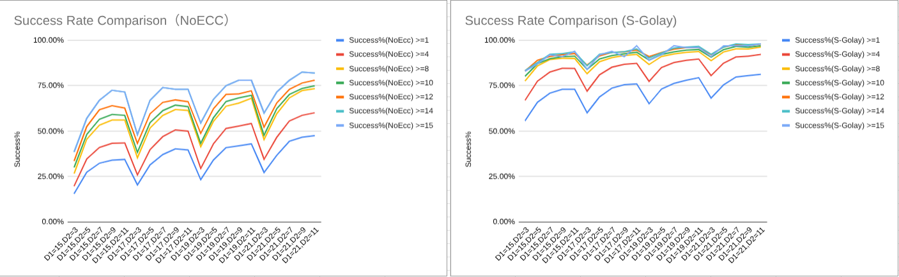
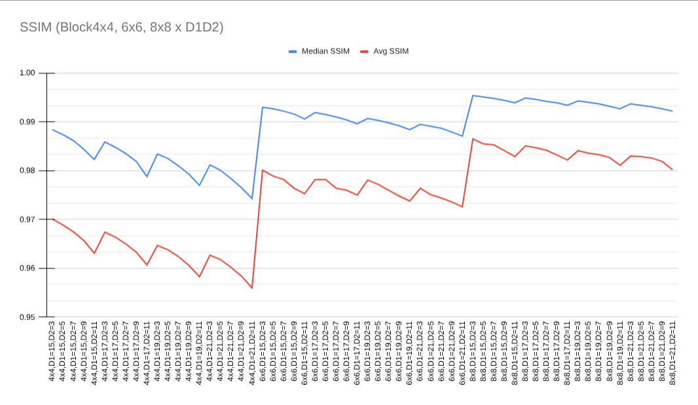
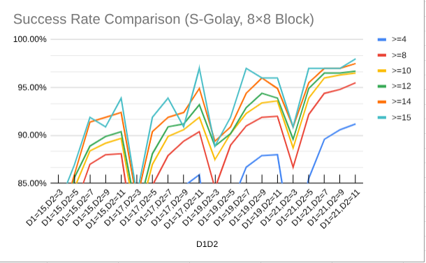

## `WithoutECC` vs `WithGolay` 

マークの符号化についての比較、解説です。

`WithoutECC`は従来の[]byte列をそのままbit列に変換して埋め込みに使用します。
例えば`a`であれば、`0x61` -> `0b01100001`

`WithGolay`はゴレイ符号化(23,12)を用いた誤り補正可能なbit列を利用します。ゴレイ符号は12bitのデータに対して23bitに符号化し3bitの誤り訂正を可能にする誤り訂正符号です。
例えば、12bit列をゴレイ符号化を行った場合、23bit列となります。

結論として`WithGolay`の利用を強く推奨します。

### 電子透かしにおける特性

電子透かしの取り出しでは、bit列のすべてが正しく取り出せたときに始めて成功となります。
言い換えれば、全体のうち1bitでも誤った場合、失敗とみなされます。例えば、100bitを埋め込み、正しく取り出せたのが50bitでも、1bitでも、99bitでも、100bitでない限りすべて失敗です。

`WithoutECC`の場合はまさに1bitも誤ってはいけない故に*取り出しの成功率が落ちる可能性が高い*と言えます。

ゴレイ符号化を用いた`WithGolay`の場合、ほとんど2倍の情報量を埋め込みますが、誤り訂正によって多少の誤りがあっても成功とできる、つまり*取り出しの成功率が上がる可能性を高める*ことが期待できます。

### 比較



#### 参考: ゴレイ符号化パッケージ

https://pkg.go.dev/github.com/yyyoichi/golay

```
go get github.com/yyyoichi/golay
```

## パラメータとノイズ量

D1,D2のパラメータは大きくすることで取り出し成功率は上がります。一方で画質は低下します。
また、画像を細かいブロックを分割すれば埋め込み数は上昇しますが、ノイズ量は増えます。





## 参考

この例は[./exp](./exp/)に実装しています。
すべてJPEG圧縮に対する耐性調査として実施されました。
