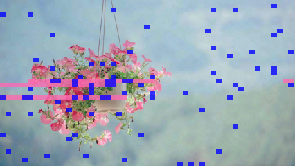
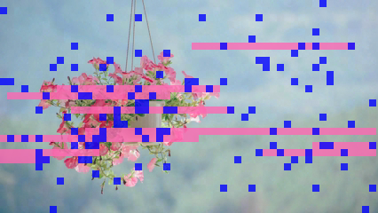

# EXPERIMENT_04 (ランダム埋め込みによる誤り分散とJPEG圧縮の影響)

## 概要
本実験では、EXPERIMENT_03 で観察された誤り分布の非ランダム性（特定ブロックへの誤り集中）に対処するため、ビット埋め込み位置をランダムに分散させる手法を導入した。これにより、Golay 符号の誤り訂正能力（各ブロック最大3bit）を最大限活用し、局所的な誤り集中による訂正失敗を回避することを目指した。

## 背景
EXPERIMENT_03 では Golay 符号による取り出し性能の改善を確認したが、エンコード済みビット列で高い一致率（90%超）を達成してもデコード後に完全復元できないケースが残存した。これは誤りが特定の Golay ブロックに集中し、1ブロックあたり3bit を超過することで訂正不能になる状況を示唆していた。

ヒートマップ可視化（heatmap コマンド）により、誤りが画像の高周波領域（エッジや細かいテクスチャ部分）に偏在していることが観察された。JPEG 圧縮は高周波成分を優先的に削減するため、これらの領域に埋め込まれたビットが劣化しやすく、連続する複数の Golay ブロックが同時に破損する原因となっていた。

## 目的
1. ビット埋め込み位置をランダムに分散させることで、高周波領域の誤りを複数の Golay ブロックに分散し、ブロックあたりの誤りビット数を3bit 以内に抑える。
2. ランダム分散埋め込み（ShuffledGolay）と通常埋め込み（Normal, Golay）の取り出し成功率を定量比較する。
3. 画像サイズと誤り分散効果の関係を明らかにする。

## 実験方法
### アルゴリズム比較
- **Normal**: 生ビット列を順次埋め込み（誤り訂正なし）
- **Golay**: Golay(23,12) 符号化後、順次埋め込み
- **ShuffledGolay**: Golay 符号化後、Fisher-Yates シャッフルでビット順序をランダム化してから埋め込み

### 評価指標
- EncodedAcc: 抽出ビット列と符号化ビット列の一致率
- DecodedAcc: デコード後の元ビット列との一致率
- Success: DecodedAcc が 100% のケースを成功と判定

### テスト条件
- 画像サイズ: 854×480 〜 426×240（9段階）
- BlockShape: 6×6, 6×8, 8×8
- D1/D2 パラメータ: 36×20, 30×17, 25×14, 20×11, 15×8
- 総テストケース: 10画像 × 9サイズ × 3ブロック形状 × 5パラメータ × 3アルゴリズム = 4,050 テスト

## 主な観察結果
### 1. 誤り分布の空間的偏在
ヒートマップ解析により以下を確認：
- 誤りは画像の高周波領域（エッジ、細かいテクスチャ）に集中
- JPEG 圧縮（Quality 100）でも高周波成分の量子化により、これらの領域で埋め込みビットが劣化
- 順次埋め込みでは連続する Golay ブロックが同一の高周波領域に配置され、複数ブロックが同時に破損

### 2. ランダム分散埋め込みの効果

result_04.txt の統計比較（画像サイズごとのアルゴリズム成功率）：

**大きな画像（854×480）**:
- Normal: 124/150 成功（82.7%）
- Golay: 128/150 成功（85.3%）
- ShuffledGolay: 136/150 成功（90.7%）
- 効果: ShuffledGolay で Normal 比 +8.0%、Golay 比 +5.4% 改善

**中程度の画像（640×360）**:
- Normal: 63/150 成功（42.0%）
- Golay: 88/150 成功（58.7%）
- ShuffledGolay: 100/150 成功（66.7%）
- 効果: ShuffledGolay で Normal 比 +24.7%、Golay 比 +8.0% 改善

**小さな画像（426×240）**:
- Normal: 4/150 成功（2.7%）
- Golay: 12/150 成功（8.0%）
- ShuffledGolay: 25/150 成功（16.7%）
- 効果: ShuffledGolay で Normal 比 +14.0%（約6.2倍）、Golay 比 +8.7%（約2.1倍）

#### 実行結果

全10画像に対する画像サイズごとのアルゴリズム比較：

| Size | Normal | Golay | SfGolay |
|------|--------|-------|---------|
| 854x480 | 124/150 (E:99.9% D:99.9%) | 128/150 (E:98.9% D:99.7%) | 136/150 (E:98.9% D:99.8%) |
| 800x450 | 94/150 (E:99.7% D:99.7%) | 123/150 (E:98.5% D:99.4%) | 130/150 (E:98.6% D:99.6%) |
| 768x432 | 100/150 (E:99.6% D:99.6%) | 123/150 (E:98.5% D:99.5%) | 133/150 (E:98.4% D:99.8%) |
| 720x405 | 84/150 (E:99.6% D:99.6%) | 112/150 (E:98.0% D:99.3%) | 126/150 (E:98.0% D:99.5%) |
| 640x360 | 63/150 (E:99.4% D:99.4%) | 88/150 (E:96.6% D:98.2%) | 100/150 (E:96.6% D:98.7%) |
| 600x338 | 49/150 (E:98.8% D:98.8%) | 73/150 (E:95.8% D:97.6%) | 86/150 (E:95.7% D:98.0%) |
| 512x288 | 18/150 (E:98.1% D:98.1%) | 38/150 (E:93.2% D:95.3%) | 61/150 (E:93.1% D:95.4%) |
| 480x270 | 14/150 (E:97.2% D:97.2%) | 29/150 (E:91.9% D:93.8%) | 47/150 (E:92.0% D:94.3%) |
| 426x240 | 4/150 (E:96.3% D:96.3%) | 12/150 (E:89.3% D:91.0%) | 25/150 (E:89.3% D:91.2%) |

表記: 成功数/総数 (E:平均エンコード精度 D:平均デコード精度)

[reuslt_04.txt](./results/result_04.txt)

### 3. 画像サイズと分散効果の相関
- 小さな画像ほど EmbedCount（埋め込み冗長度）が低下し、特定の高周波領域の影響を受けやすい
- 例: 426×240, BlockShape=8×8 では EmbedCount が 2.39 程度まで低下
- この条件下では、順次埋め込みで高周波領域に配置された Golay ブロックが集中的に破損
- ランダム分散により、各 Golay ブロックが異なる周波数特性の領域からビットを収集し、ブロックあたりの誤りビット数を平準化
- 画像サイズと改善効果の相関:
  - 大画像（854×480）: Normal 82.7% → ShuffledGolay 90.7%（+8.0%）
  - 中画像（640×360）: Normal 42.0% → ShuffledGolay 66.7%（+24.7%）
  - 小画像（426×240）: Normal 2.7% → ShuffledGolay 16.7%（+14.0%、6.2倍）

## 考察
### ランダム分散の効果メカニズム
1. **誤り分散**: 高周波領域の誤りビットが複数の Golay ブロックに分散され、1ブロックあたり3bit 以下に抑制
2. **リスク分散**: 連続ブロックが同一の劣化領域に配置されるリスクを回避
3. **統計的安定性**: 各ブロックが画像全体からランダムサンプリングすることで、局所的な JPEG アーティファクトの影響を軽減

### JPEG 圧縮の影響
- Quality 100 でも DCT 量子化により高周波成分が優先的に劣化
- 特に小画像では、相対的に高周波成分の占める面積比率が高く、影響が顕著
- 今後、JPEG 圧縮を前提とした埋め込み戦略（低周波領域優先、適応的強度調整）の検討が必要

### 限界と残存課題
- ランダム分散でも完全成功に至らないケースが存在（426×240 で 125/150 失敗、成功率 16.7%）
- 最も小さい画像サイズでは、平均デコード精度が 91.2% に留まり、Golay の理論訂正能力でもカバーできない劣化が発生
- 画像サイズが小さくなるほど、エンコード精度とデコード精度の差が拡大（426×240: E:89.3% vs D:91.2%）
- これらは EmbedCount が極端に低い条件（<2.5）で、画像全体の劣化度が高く、ブロックあたり 3bit を超える誤りが頻発していると推測
- シャッフルのシード固定により再現性は確保されているが、シード依存性の評価が未実施

## 次の取り組み (Future Work)
1. **周波数領域解析**: DCT/DWT 係数レベルでの埋め込み位置と誤り率の相関分析
2. **適応的埋め込み**: 画像の周波数特性に応じた埋め込み強度の動的調整
3. **圧縮耐性評価**: Quality パラメータを変化させた JPEG 圧縮下での性能評価
4. **他の誤り訂正符号**: BCH, Reed-Solomon などとの比較（符号化率と訂正能力のトレードオフ）
5. **インターリーブ深度最適化**: シャッフルパターンの体系的評価（ブロック単位、ビット単位、階層的）

## まとめ
- ランダム埋め込み分散（ShuffledGolay）により、全画像サイズで成功率が向上
  - 大画像（854×480）: 82.7% → 90.7%（+8.0%）
  - 中画像（640×360）: 42.0% → 66.7%（+24.7%）
  - 小画像（426×240）: 2.7% → 16.7%（6.2倍）
- ヒートマップ解析により、誤りが JPEG 圧縮の影響を受けやすい高周波領域に集中することを確認
- 誤り分散により Golay 符号の理論的訂正能力（3bit/block）を効果的に活用できることを実証
- 画像サイズが小さいほど（EmbedCount が低いほど）特定領域の影響を受けやすく、ランダム分散の相対的効果が大きい
- ただし、最小画像サイズ（426×240）では依然として成功率 16.7% に留まり、さらなる改善手法が必要

本実験により、空間的に非ランダムな誤り分布に対しては、符号化だけでなく埋め込み配置戦略が重要であることが示された。特に EmbedCount が低い条件下では、ランダム分散が必須となる。今後は周波数領域での詳細解析と適応的手法の開発により、さらなる頑健性向上を目指す。

---
本ドキュメントは yyyoichi のもと GitHub Copilot によって文書化されました。
